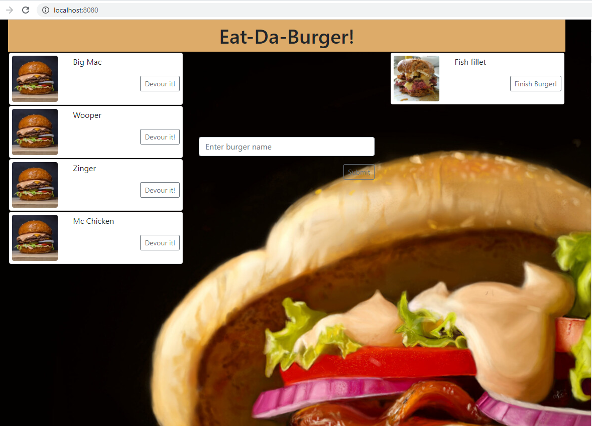

# Eat-Da-Burger!

## Application details

* Eat-Da-Burger! is a restaurant app that lets users input the names of burgers they'd like to eat.

* Whenever a user submits a burger's name, the app will display the burger on the left side of the page -- waiting to be devoured.

* Each burger in the waiting area also has a `Devour it!` button. When the user clicks it, the burger will move to the right side of the page.
### Links
-  Github
> https://github.com/JameskuttySebastian/burger

-  Heroku
> https://pacific-harbor-11291.herokuapp.com/
-  Portfolio page
>https://jameskuttysebastian.github.io/ASSIGNMENT8_UpdatedPortfolioPage/portfolio.html

